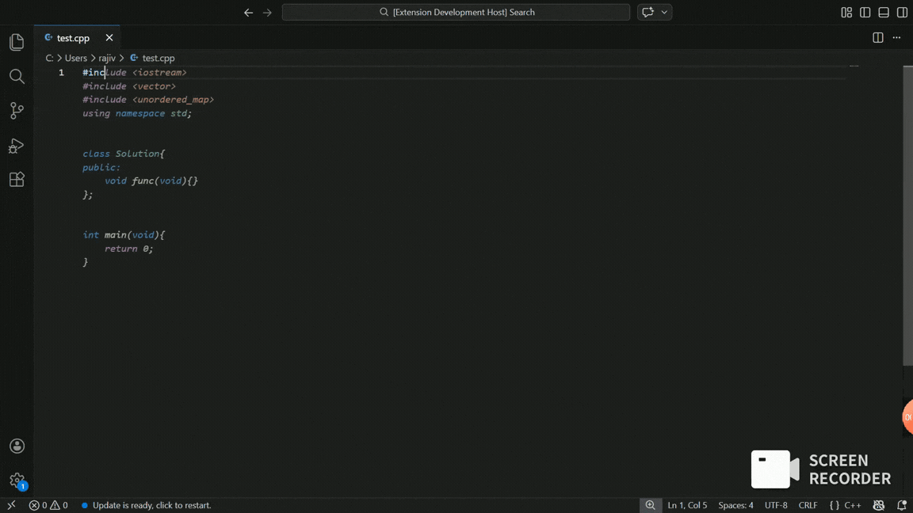

# VSnippet Engine

Local-first snippet intelligence for VS Code with deterministic ghost text and fast prefix matching.

[](./CHANGELOG.md)
[](./LICENSE)
[](https://code.visualstudio.com/)

## Contents

- [Why VSnippet](#why-vsnippet)
- [Feature Highlights](#feature-highlights)
- [Animated Product Tour](#animated-product-tour)
- [Installation](#installation)
- [Quick Start](#quick-start)
- [Commands](#commands)
- [Settings](#settings)
- [Snippet Storage Model](#snippet-storage-model)
- [Language Normalization](#language-normalization)
- [Architecture](#architecture)
- [Development](#development)
- [Packaging and Publishing](#packaging-and-publishing)
- [Troubleshooting](#troubleshooting)
- [License](#license)

## Why VSnippet

VSnippet is built for developers who want snippet speed without cloud latency or prompt-style tooling noise:

- Fully local snippet storage
- Language-aware snippet indexing
- Trie-backed prefix search for low-latency lookup
- Ghost text that can be committed with `Tab`
- Configurable prioritization to reduce interference from other suggestion engines

## Feature Highlights

| Capability | What it does | Why it matters |
|---|---|---|
| Inline ghost text | Shows snippet expansion as you type | Faster than opening command palettes |
| `Tab` commit for inline suggestion | Commits visible VSnippet suggestion | Predictable snippet acceptance flow |
| IntelliSense snippet candidates | Provides completion list items for snippet keys | Works with normal VS Code completion UX |
| Overlap-aware insertion | Avoids duplicating already-typed prefix text | Correct expansion for flows like `int add` |
| Local snippet persistence | Stores snippets by language on disk | Portable and auditable snippet source |
| Live reload | Reloads snippet cache when files change | No editor restart required |
| QuickPick insertion | Search and insert snippets by key | Fast fallback when typing trigger is unknown |

## Animated Product Tour


### 1) Save selected code as a snippet


### 2) Ghost text appears from snippet key prefix


### 3) Commit ghost text using Tab




## Installation

### Marketplace

1. Open VS Code Extensions.
2. Search for `VSnippet Engine`.
3. Click `Install`.

### Local `.vsix`

1. Run `Extensions: Install from VSIX...`
2. Select your packaged `.vsix`.

## Quick Start

1. Open a source file (`cpp`, `python`, `javascript`, `typescript`, etc.).
2. Select reusable code.
3. Run `Save Snippet`.
4. Give it a key, for example `binary_search`.
5. Type the key prefix later in the same language.
6. Accept ghost text with `Tab`, or run `Insert Snippet`.

## Commands

| Command | ID | Default keybinding |
|---|---|---|
| Insert Snippet | `vsnippetEngine.insertSnippet` | `Ctrl+Alt+S`, `Ctrl+K Ctrl+I` |
| Save Snippet | `vsnippetEngine.saveSnippet` | `Ctrl+Alt+A`, `Ctrl+K Ctrl+A` |
| Reload Snippets | `vsnippetEngine.reloadSnippets` | Command Palette |
| Open Snippet Folder | `vsnippetEngine.openSnippetFolder` | Command Palette |

## Settings

```json
{
  "vsnippetEngine.snippetFolder": "~/.codesnippet-engine",
  "vsnippetEngine.enableInlineAutocomplete": true,
  "vsnippetEngine.enableTrieMatching": true,
  "vsnippetEngine.prioritizeInlineCompletions": true
}
```

| Setting | Type | Default | Description |
|---|---|---|---|
| `vsnippetEngine.snippetFolder` | `string` | `~/.codesnippet-engine` | Root folder containing language snippet folders |
| `vsnippetEngine.enableInlineAutocomplete` | `boolean` | `true` | Enables ghost text from local snippets |
| `vsnippetEngine.enableTrieMatching` | `boolean` | `true` | Enables Trie-based prefix search |
| `vsnippetEngine.prioritizeInlineCompletions` | `boolean` | `true` | Prioritizes VSnippet inline `Tab` commit and ordering |

## Snippet Storage Model

Default root:

```text
~/.codesnippet-engine/
```

Structure:

```text
.codesnippet-engine/
  cpp/
    binary_search.cpp
    dsu_union.cpp
  python/
    fast_pow.py
  javascript/
    debounce.js
  typescript/
    api_client.ts
```

- One file = one snippet
- Filename (without extension) = snippet key
- Snippets are cached in-memory and reloaded on changes

## Language Normalization

`document.languageId` is normalized for common variants:

- `typescriptreact -> typescript`
- `javascriptreact -> javascript`
- `cplusplus -> cpp`
- `plaintext -> text`

## Architecture

- `src/trie.ts`: Trie prefix index
- `src/snippetLoader.ts`: disk loading
- `src/snippetManager.ts`: in-memory cache + persistence
- `src/inlineCompletionProvider.ts`: ghost text provider
- `src/completionProvider.ts`: IntelliSense provider
- `src/commands/*`: command implementations
- `src/extension.ts`: activation + wiring + context updates

## Development

```bash
npm install
npm run compile
```

For local testing:

1. Press `F5` (Extension Development Host).
2. Use the `Run VSnippet (Clean)` launch profile.
3. Validate ghost text + `Tab` commit + command flows.

Detailed manual scenarios: [Usage Guide](./docs/USAGE_GUIDE.md)

## Packaging and Publishing

```bash
npm run package
npm run publish:patch
```

Pre-publish checklist: [Production Checklist](./docs/PRODUCTION_CHECKLIST.md)

## Troubleshooting

- Ghost text not visible:
  - Ensure `editor.inlineSuggest.enabled` is true.
  - Ensure `vsnippetEngine.enableInlineAutocomplete` is true.
  - Ensure snippet key prefix length is at least 2 characters.
- `Tab` not committing VSnippet:
  - Ensure `vsnippetEngine.prioritizeInlineCompletions` is true.
  - Ensure an inline suggestion is visible.
- Snippets not found:
  - Run `Reload Snippets`.
  - Verify `vsnippetEngine.snippetFolder` path.

## License

MIT. See [LICENSE](./LICENSE).
